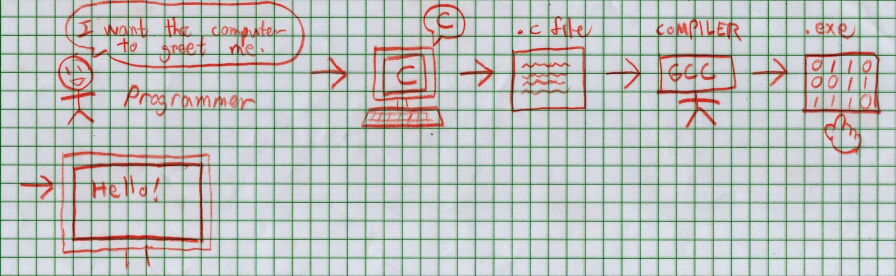
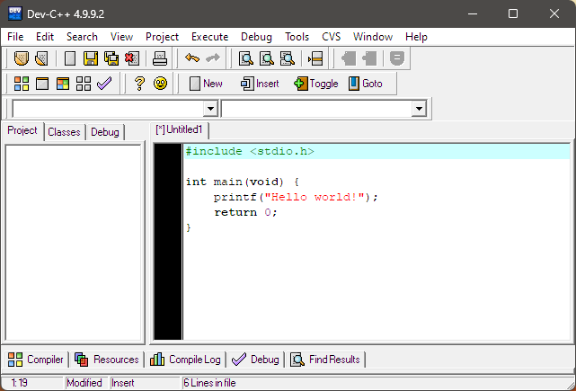

> :link: [CCPROG1 Index](index.md)
>
> :memo: If you're just starting out, then don't worry too much! Immerse yourself slowly and steadily.

# The Absolute Basics of Programming

**Programming is a form of problem solving.** However, what sets apart programming from the usual problem solving is that we must create solutions that are understood by both computers and humans, instead of only the latter. Take the following scenario, for example:

> :question: Which is the highest number among these: 3, 5, 1, 0, or 999?

The answer is obviously 999, but a computer does not have the common sense to say what we have so easily observed. Instead, computers follow a *program* or a series of instructions executed by a computer, and *programming* is to create such programs via a programming language.

(In the grand scheme of things, [programs don't have to be self-contained:](../03-CCPROG3/01-IntroToOOP.md) programs can exist as *subprograms* or generally as parts of a bigger program, such as in complex applications like web browsers, video games, and artificial intelligence applications.)

## Programming Languages

If one were to list down an exact sequence of steps in order to figure out the highest number in a list, one may come up with the following *pseudocode* ("fake code" meant to describe a process):

```
For each number in the list:
    if this number is the first number, then:
        remember it;
    if this number is not the first number
        and it is greater than the number previously remembered, then:
        remember the new number.
The last number remembered is the highest number in the list.
```

*Pseudocode.*

Precise and exact as it may (and must) be, computers wouldn't actually understand this, as it is not written in a language the computer understands. A traditional computer only understands ones and zeroes -- two digits (**bi**nary digi**ts**, or *bits*) that correspond to the electrical components underneath which only have two states: `ON (1)` and `OFF (0)` (more on this in [CCICOMP](../../Computing/01-CCICOMP/index.md)).

Thankfully, we do not have to program in just ones and zeroes: many a programming langauge has been made as an abstraction over binary. A *programming language* is a tool that enables programmers to communicate with the computer in an abstracted manner through *code* following certain *syntax* (grammar rules).

There are many different programming languages, each serving their own purposes. Some programming languages include:

1. C, a foundational pioneer (and the focus of CCPROG1 and [CCPROG2](../02-CCPROG2/index.md))
2. C++, a big extension of C
3. Python, a popular data science choice
4. [Java, suitable for complex enterprise applications (and the focus of CCPROG3)](../03-CCPROG3/index.md)
5. Assembly, the lowest you can go before writing in machine code (1s and 0s)



*The programming process for C*

Programming languages have the ability of being able to be translated into *machine code*, which is a binary representation that machines can understand. It varies how exactly (human-readable) code in a particular programming language gets translated into machine code. In C, programs are first *compiled* into machine code (via a C compiler such as GCC) and the machine code is then executed (more on this soon).

## The Programming Process

In CCPROG1, the focus is on creating programs (via the C programming language) to solve problems. This entails building up logic skills to reason about various scenarios. This almost always involves processing a given input into an expected output, like so:

$$Input \rightarrow [Program] \rightarrow Output$$

*The proverbial **black box** model of programming.*

It is up to us programmers to create a program which transforms expected inputs into desired outputs. Ideally, the resulting program would be a *black box*, where users do not really have to know how the program works, only that it does work correctly.

### Integrated Development Environment (IDE)

When it comes to actually writing programs, programmers tend to program in an *integrated development environment* (IDE), which is a set of tools used to write and run programs efficiently.



CCPROG1 introduces [Dev-C++ as a beginner-friendly IDE;](https://www.bloodshed.net/) there are many alternatives, however, such as [the popular Visual Studio Code (VSCode)](https://code.visualstudio.com/). Those more comfortable with programming may opt to use text editors such as [Vim, a "highly configurable text editor"](https://www.vim.org/) or even the venerable Notepad included by default on Windows!

> Next: [Hello, World!](02-HelloWorld.md)

## Terms Used
1. programming
2. problem solving
3. program
4. programming language
5. pseudocode
6. binary
7. bits
8. abstraction
9. code
10. syntax
11. machine code
12. black box
13. integrated development environment (IDE)
